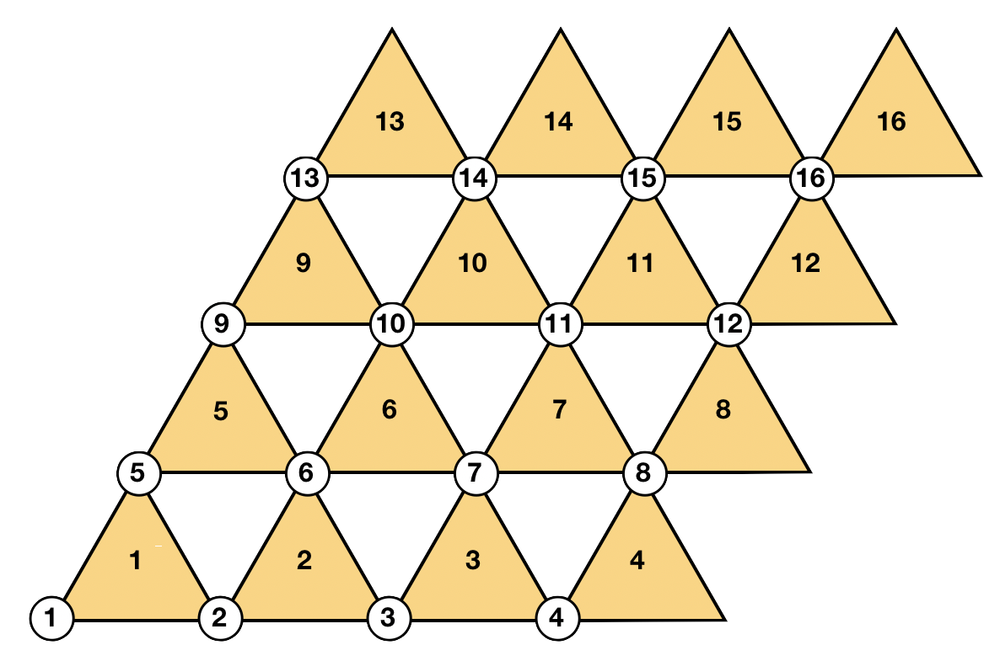

# NewmanMooreMC
Simple Monte Carlo program for the Newman Moore model:
a 3-spin model composed of Ising spins σ = ±1 on a triangular lattice with short-range interactions and a single-spin-flip dynamics.

The Hamiltonian is
 

Reference:
https://arxiv.org/pdf/cond-mat/9707273.pdf

MC reference:
https://arxiv.org/pdf/1404.0209.pdf
